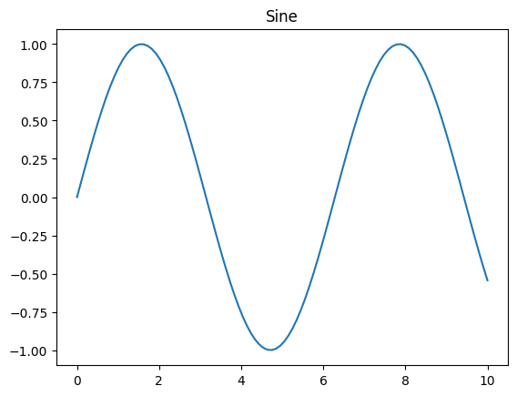

# Colab CLI: Demo Walkthroughs

*Captured 2026-05-07 against a live Colab backend with `showboat` 0.6.1.*
<!-- showboat-id: a24e677e-5052-4bec-8f82-36eb7a7859f9 -->

Eleven scenarios that exercise common workflows, plus a final "bridging back to the browser" example. Every `colab` invocation below was actually executed; the text inside each `output` block was captured verbatim from stdout/stderr.

**Methodology**
- Auth: `--auth=adc`. To set up: `gcloud auth application-default login --scopes=openid,https://www.googleapis.com/auth/cloud-platform,https://www.googleapis.com/auth/userinfo.email,https://www.googleapis.com/auth/colaboratory`.
- Accelerator: every session uses **CPU**. Provisioning real accelerators is gated by per-account quota and would not work for most readers; the workflows themselves are accelerator-agnostic, so where a demo's narrative mentions a GPU or TPU the prose flags the substitution.
- Interactive subcommands — `colab auth`, `colab drivemount`, and unpiped `colab repl` / `colab console` — are **not run** here because they require human interaction at a TTY. Demos that would normally use them include an inline note explaining what they do and the workflow continues with the non-interactive parts.
- `enable_update_check` is set to `false` in `~/.config/colab-cli/settings.json` for the duration of recording so the daily upgrade banner doesn't pollute output.
- `PYTHONWARNINGS=ignore` is set in the environment to suppress the ADC quota-project warning that `google.auth` emits on every call from end-user credentials.

**Re-verifiability caveat**: this document is **not** re-verifiable with `showboat verify`. Each `colab new` produces a fresh server-assigned session endpoint (`m-s-...`), so the recorded output never matches a re-run exactly. Treat this as a one-time witness that the workflows succeeded as of the recording date.

## Demo 1: Cloud-native scientist

Provision a session, run a JAX workload over a small dataset, then tear the session down. Demonstrates the headline pattern of `colab new` → `colab exec` → `colab stop`. (A full-fidelity run of this scenario would also call `colab auth` and `colab drivemount` so the JAX code could read from BigQuery and write to Drive — both interactive, see the skip note below — and would request a TPU instead of CPU.)

```bash
uv run colab --auth=adc new -s research
```

```output
[colab] Creating session 'research'...
[colab] Session READY.
```

*Skipped:* `colab auth -s research` and `colab drivemount -s research`. Both require interactive TTY consent — `auth` prompts the user to visit an OAuth URL and paste back a verification code; `drivemount` prompts for an Enter keypress after the user grants consent in their browser. Verified separately in `integration/`.

```bash
uv run colab --auth=adc install -s research jax 2>&1 | tail -20
```

```output
[colab] Installing packages on research (preferring uv)...
Installation Complete (via uv)!
```

```bash
cat <<'EOF' | uv run colab --auth=adc exec -s research
import jax, jax.numpy as jnp
import numpy as np

# (BigQuery substituted with synthetic data — would normally use:
#   df = bigquery.Client().query('SELECT * FROM bigquery-public-data.ml_datasets.iris LIMIT 100').to_dataframe())
data = np.random.RandomState(0).randn(100, 4)

print('Devices:', jax.devices())
w = jax.random.normal(jax.random.PRNGKey(0), (4, 4))
out = jax.jit(lambda x, w: x @ w)(jnp.array(data), w)
print(f'Processed {len(out)} rows.')
EOF

```

```output
Devices: [CpuDevice(id=0)]
Processed 100 rows.
```

```bash
uv run colab --auth=adc stop -s research
```

```output
[colab] Stopping session 'research'...
[colab] Session terminated.
```

## Demo 2: Fast iteration on GPU

A typical model-training cycle: provision → install dependencies → run a training script → check status → download the resulting checkpoint. The script here is a 1-layer linear regression on synthetic data so it finishes in a few seconds on CPU; substitute your real training code and `--gpu A100` for a production run.

```bash
uv run colab --auth=adc new -s trainer
```

```output
[colab] Creating session 'trainer'...
[colab] Session READY.
```

```bash
uv run colab --auth=adc install -s trainer torch 2>&1 | tail -5
```

```output
[colab] Installing packages on trainer (preferring uv)...
Installation Complete (via uv)!
```

```bash
uv run colab --auth=adc exec -s trainer -f /tmp/train.py
```

```output
Epoch 1/10: loss 14.380
Epoch 2/10: loss 11.639
Epoch 3/10: loss 9.440
Epoch 4/10: loss 7.671
Epoch 5/10: loss 6.247
Epoch 6/10: loss 5.097
Epoch 7/10: loss 4.167
Epoch 8/10: loss 3.414
Epoch 9/10: loss 2.802
Epoch 10/10: loss 2.305
Training complete.
```

```bash
uv run colab --auth=adc download -s trainer /content/model.bin /tmp/model.bin && ls -la /tmp/model.bin
```

```output
[colab] Downloaded '/content/model.bin' to '/tmp/model.bin'
-rw-r----- 1 rtp primarygroup 1877 May  7 23:11 /tmp/model.bin
```

```bash
uv run colab --auth=adc status -s trainer
```

```output
[trainer] m-s-kkb-usw1c0-21g32dh850cd4 | Hardware: CPU | Variant: DEFAULT | Status: IDLE
  Last Execution: /tmp/train.py at 2026-05-07 23:11:32
```

```bash
uv run colab --auth=adc stop -s trainer
```

```output
[colab] Stopping session 'trainer'...
[colab] Session terminated.
```

## Demo 3: Interactive troubleshooting (piped)

Both `colab console` and `colab repl` accept piped stdin and exit on EOF, so they compose well with shell pipelines and other CLI tools. This demo investigates remote disk usage with a one-shot shell command, lists `/content`, creates and removes a scratch file, and then queries free space from a one-shot REPL.

```bash
uv run colab --auth=adc new -s debug
```

```output
[colab] Creating session 'debug'...
[colab] Session READY.
```

*Note:* `colab console` connects to a tmux-wrapped pty on the VM, so even when stdin is piped the raw stdout contains terminal-control bytes (cursor moves, status-line repaints, ANSI color). For programmatic consumption, pipe the output through `grep -a` (force binary-safe) and a regex matching the line(s) you care about, as shown below.

```bash
echo 'df -h /content' | uv run colab --auth=adc console -s debug 2>&1 | grep -aE 'overlay|/dev/'
```

```output
overlay         108G   21G   87G  20% /
```

```bash
uv run colab --auth=adc ls -s debug /content
```

```output
.config/
sample_data/
```

```bash
echo 'with open("/content/scratch.log", "w") as f: f.write("x" * 1024 * 100)
print("created scratch.log (100 KB)")' | uv run colab --auth=adc exec -s debug
```

```output
created scratch.log (100 KB)
```

```bash
uv run colab --auth=adc rm -s debug /content/scratch.log
```

```output
[colab] Deleted /content/scratch.log
```

```bash
echo 'import shutil; print(shutil.disk_usage("/").free // 2**30, "GB free")' | uv run colab --auth=adc repl -s debug
```

```output
86 GB free
```

```bash
uv run colab --auth=adc stop -s debug
```

```output
[colab] Stopping session 'debug'...
[colab] Session terminated.
```

## Demo 4: Multi-modal output (plots & notebooks)

Demonstrates plot redirection (`--output-image`) and notebook execution (`colab exec -f file.ipynb` writes outputs back into `<name>_output.ipynb`).

```bash
uv run colab --auth=adc new -s reporter
```

```output
[colab] Creating session 'reporter'...
[colab] Session READY.
```

```bash
cat <<'EOF' | uv run colab --auth=adc exec -s reporter --output-image /tmp/sine.png
import matplotlib.pyplot as plt, numpy as np
x = np.linspace(0, 10, 100)
plt.plot(x, np.sin(x)); plt.title('Sine'); plt.show()
EOF

```

```output
<Figure size 640x480 with 1 Axes>

[Image saved to: /tmp/sine.png]
```

```bash {image}

```



```bash
uv run colab --auth=adc exec -s reporter -f /tmp/analysis.ipynb && ls /tmp/analysis_output.ipynb
```

```output
[colab] Parsing notebook '/tmp/analysis.ipynb'...
[colab] Executing cell 1/2 - a8850b8f...
mean = 18
stdev = 13.49
[colab] Executing cell 2/2 - c31a0002...
rows: 6
sum: 108
[colab] Saving notebook with outputs to '/tmp/analysis_output.ipynb'...
/tmp/analysis_output.ipynb
```

```bash
uv run colab --auth=adc log -s reporter -o /tmp/reporter.md && wc -l /tmp/reporter.md
```

```output
[colab] Exported history to '/tmp/reporter.md'.
55 /tmp/reporter.md
```

```bash
uv run colab --auth=adc stop -s reporter
```

```output
[colab] Stopping session 'reporter'...
[colab] Session terminated.
```

## Demo 5: Bulk data via GCS

Pull a batch of objects down from a Google Cloud Storage bucket, transform them on the VM, and pull the results back. A full-fidelity workflow is `colab new --gpu L4` -> `colab auth` (so VM-side `gcloud` works) -> `gcloud storage cp gs://bucket/raw/*.jpg /content/images/` (via piped `colab console`) -> install pillow/torchvision -> process -> download. We skip the auth step here (interactive; the user has to click through OAuth) and substitute synthetic image generation in place of the GCS pull, which keeps the input -> install -> batch-process -> download shape intact.

```bash
uv run colab --auth=adc new -s data-proc
```

```output
[colab] Creating session 'data-proc'...
[colab] Session READY.
```

```bash
uv run colab --auth=adc install -s data-proc pillow 2>&1 | tail -3
```

```output
[colab] Installing packages on data-proc (preferring uv)...
Installation Complete (via uv)!
```

```bash
cat <<'EOF' | uv run colab --auth=adc exec -s data-proc
# (would normally pull from GCS via 'gcloud storage cp gs://my-bucket/raw_data/*.jpg')
import os, zipfile
from PIL import Image, ImageFilter
os.makedirs('/content/images', exist_ok=True)
os.makedirs('/content/processed', exist_ok=True)
# Generate 10 synthetic input images
for i in range(10):
    Image.new('RGB', (64, 64), (i * 25, 100, 200 - i * 15)).save(f'/content/images/img_{i:02d}.jpg')
# Process: blur each
for src in sorted(os.listdir('/content/images')):
    img = Image.open(f'/content/images/{src}').filter(ImageFilter.GaussianBlur(2))
    img.save(f'/content/processed/{src}')
# Zip results
with zipfile.ZipFile('/content/processed/batch.zip', 'w') as z:
    for f in sorted(os.listdir('/content/processed')):
        if f.endswith('.jpg'):
            z.write(f'/content/processed/{f}', f)
print(f'Processed {len(os.listdir("/content/processed")) - 1} images, archived to batch.zip')
EOF

```

```output
Processed 10 images, archived to batch.zip
```

```bash
uv run colab --auth=adc download -s data-proc /content/processed/batch.zip /tmp/batch.zip && ls -la /tmp/batch.zip
```

```output
[colab] Downloaded '/content/processed/batch.zip' to '/tmp/batch.zip'
-rw-r----- 1 rtp primarygroup 7902 May  7 23:19 /tmp/batch.zip
```

```bash
uv run colab --auth=adc stop -s data-proc
```

```output
[colab] Stopping session 'data-proc'...
[colab] Session terminated.
```

## Demo 6: Resource check & subscription

Inspect a long-running session, then export its history as a notebook for archival. (`colab pay`, which opens `https://colab.research.google.com/signup` in the system browser to manage compute units, would normally fit here too — we don't invoke it because it would pop a browser window in the recording environment.)

```bash
uv run colab --auth=adc new -s long-running
```

```output
[colab] Creating session 'long-running'...
[colab] Session READY.
```

```bash
uv run colab --auth=adc status -s long-running
```

```output
[long-running] m-s-kkb-use4a2-2qvalahyh7yzg | Hardware: CPU | Variant: DEFAULT | Status: IDLE
```

```bash
echo 'print("hello from session")' | uv run colab --auth=adc exec -s long-running
```

```output
hello from session
```

```bash
uv run colab --auth=adc log -s long-running -o /tmp/checkpoint.ipynb && ls -la /tmp/checkpoint.ipynb
```

```output
[colab] Exported history to '/tmp/checkpoint.ipynb'.
-rw-r----- 1 rtp primarygroup 974 May  7 23:20 /tmp/checkpoint.ipynb
```

```bash
uv run colab --auth=adc stop -s long-running
```

```output
[colab] Stopping session 'long-running'...
[colab] Session terminated.
```

## Demo 7: Reproducible research

Quick exploration via piped repl, file inspection via piped exec, then capture the whole session as a notebook artifact via `colab log -o <name>.ipynb`. The notebook is replayable in the Colab UI.

```bash
uv run colab --auth=adc new -s pivot
```

```output
[colab] Creating session 'pivot'...
[colab] Session READY.
```

```bash
uv run colab --auth=adc install -s pivot scipy 2>&1 | tail -3
```

```output
[colab] Installing packages on pivot (preferring uv)...
Installation Complete (via uv)!
```

```bash
echo 'from scipy.stats import zscore; print(zscore([1.2, 1.5, 1.1, 10.4, 1.3]))' | uv run colab --auth=adc repl -s pivot
```

```output
[-0.52020639 -0.43806854 -0.54758568  1.99868773 -0.49282711]
```

```bash
uv run colab --auth=adc upload -s pivot /tmp/raw_data.csv /content/raw_data.csv
```

```output
[colab] Uploaded '/tmp/raw_data.csv' to '/content/raw_data.csv'
```

```bash
echo 'print(open("/content/raw_data.csv").read())' | uv run colab --auth=adc exec -s pivot
```

```output
id,name,score
1,alice,0.92
2,bob,0.74
3,carol,0.88
4,dave,0.61
5,eve,0.95

```

```bash
uv run colab --auth=adc log -s pivot -o /tmp/pivot_discovery.ipynb && ls -la /tmp/pivot_discovery.ipynb
```

```output
[colab] Exported history to '/tmp/pivot_discovery.ipynb'.
-rw-r----- 1 rtp primarygroup 2854 May  7 23:21 /tmp/pivot_discovery.ipynb
```

```bash
uv run colab --auth=adc stop -s pivot
```

```output
[colab] Stopping session 'pivot'...
[colab] Session terminated.
```

## Demo 8: Local + cloud hybrid

Run a local script against the remote VM and pull a result back. The full-fidelity version of this demo also calls `colab drivemount` to make Google Drive available at `/content/drive` on the VM (so the script can read shared data); `drivemount` is interactive and skipped here. The kept portion — `colab exec -f local_script.py` running a script that lives on your laptop against a kernel that lives in Colab — is the workflow worth highlighting.

```bash
uv run colab --auth=adc new -s hybrid
```

```output
[colab] Creating session 'hybrid'...
[colab] Session READY.
```

```bash
uv run colab --auth=adc exec -s hybrid -f /tmp/local_analysis.py
```

```output
Running on: Linux-6.6.113+-x86_64-with-glibc2.35
Hostname: 699413ff1767
Python: 3.12.13
This script lives on my laptop but ran on the Colab VM.
```

```bash
uv run colab --auth=adc stop -s hybrid
```

```output
[colab] Stopping session 'hybrid'...
[colab] Session terminated.
```

## Demo 9: Multi-session orchestration

Run multiple sessions concurrently, list them, inspect one, stop one. The two sessions here are both CPU; in practice you'd more likely have a mix of accelerator types (e.g. one TPU for training, one GPU for evaluation).

```bash
uv run colab --auth=adc new -s tpu-cluster && uv run colab --auth=adc new -s gpu-eval
```

```output
[colab] Creating session 'tpu-cluster'...
[colab] Session READY.
[colab] Creating session 'gpu-eval'...
[colab] Session READY.
```

```bash
uv run colab --auth=adc sessions
```

```output
[gpu-eval] m-s-kkb-usc1c0-3cickkby8ivx5 | Hardware: CPU | Variant: DEFAULT
[tpu-cluster] m-s-kkb-use1b1-3b5xes33630p3 | Hardware: CPU | Variant: DEFAULT
```

```bash
uv run colab --auth=adc status -s gpu-eval
```

```output
[gpu-eval] m-s-kkb-usc1c0-3cickkby8ivx5 | Hardware: CPU | Variant: DEFAULT | Status: IDLE
```

```bash
uv run colab --auth=adc stop -s gpu-eval && uv run colab --auth=adc stop -s tpu-cluster
```

```output
[colab] Stopping session 'gpu-eval'...
[colab] Session terminated.
[colab] Stopping session 'tpu-cluster'...
[colab] Session terminated.
```

## Demo 10: One-shot pipeline

Chain several commands with `&&` so any failure aborts. The script here is a tiny stand-in (writes a JSON result to `/content`) so the chain runs in a few seconds on CPU; the typical real version would be `--gpu A100` plus a heavier dependency like `flash-attn`.

```bash
uv run colab --auth=adc new -s pipeline \
  && uv run colab --auth=adc install -s pipeline requests 2>&1 | tail -2 \
  && uv run colab --auth=adc exec -s pipeline -f /tmp/local_pipeline.py \
  && uv run colab --auth=adc download -s pipeline /content/results.json /tmp/results.json \
  && uv run colab --auth=adc stop -s pipeline
```

```output
[colab] Creating session 'pipeline'...
[colab] Session READY.
[colab] Installing packages on pipeline (preferring uv)...
Installation Complete (via uv)!
Wrote results.json: {'status': 'ok', 'computed_at': '2026-05-07T23:22:34.924350Z', 'value': 42}
/tmp/ipykernel_38852/1782062088.py:5: DeprecationWarning: datetime.datetime.utcnow() is deprecated and scheduled for removal in a future version. Use timezone-aware objects to represent datetimes in UTC: datetime.datetime.now(datetime.UTC).
  "computed_at": datetime.datetime.utcnow().isoformat() + "Z",
[colab] Downloaded '/content/results.json' to '/tmp/results.json'
[colab] Stopping session 'pipeline'...
[colab] Session terminated.
```

## Demo 11: Reproducible environment

Upload a `requirements.txt` to the VM, install via `-r`, then verify the version on the VM matches what we asked for.

```bash
uv run colab --auth=adc new -s env-test
```

```output
[colab] Creating session 'env-test'...
[colab] Session READY.
```

```bash
uv run colab --auth=adc upload -s env-test /tmp/requirements.txt /content/requirements.txt
```

```output
[colab] Uploaded '/tmp/requirements.txt' to '/content/requirements.txt'
```

```bash
uv run colab --auth=adc install -s env-test -r /tmp/requirements.txt 2>&1 | tail -3
```

```output
[colab] Installing packages on env-test (preferring uv)...
Installation Complete (via uv)!
```

```bash
echo 'import requests; print("requests:", requests.__version__)' | uv run colab --auth=adc exec -s env-test
```

```output
requests: 2.31.0
```

## Bridging back to the browser

`colab url -s <name>` prints a URL that, when opened in a browser, makes the Colab frontend connect to the existing colab-cli session instead of provisioning a fresh VM. By default it just prints the URL (pipeable, e.g. `colab url -s s1 | xclip`); `--open` would open it directly in the system browser.

```bash
uv run colab --auth=adc url -s env-test
```

```output
https://colab.research.google.com/notebooks/empty.ipynb?dbu=%2Ftun%2Fm%2Fm-s-kkb-usc1b1-3tpcjymikv7t3
```

```bash
uv run colab --auth=adc stop -s env-test
```

```output
[colab] Stopping session 'env-test'...
[colab] Session terminated.
```

```bash
uv run colab --auth=adc sessions
```

```output
[colab] Pruned 1 stale local session(s).
[colab] No active sessions found on server.
```
